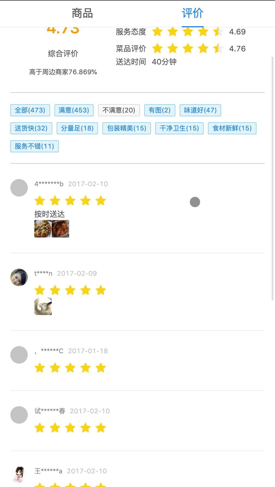
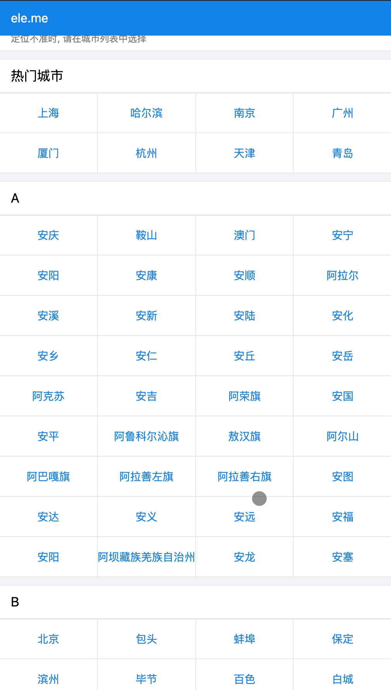
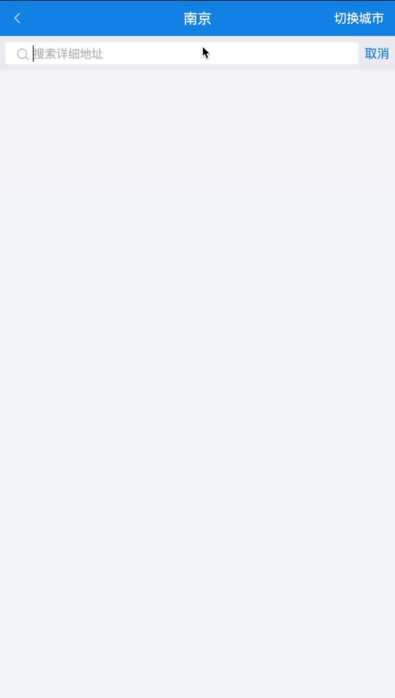
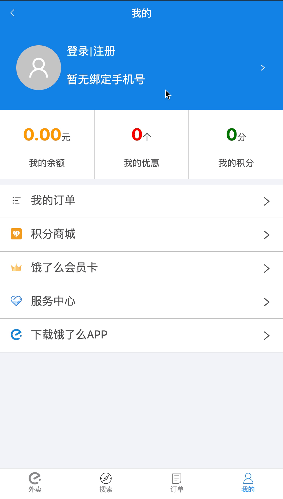

<!--
 * @Author: LinFeng
 * @LastEditors: LinFeng
 * @Date: 2020-07-25 10:19:05
 * @LastEditTime: 2020-08-03 01:31:44
 * @FilePath: /react-elm/README.md
 * @Description:
-->

# react-elm

## 说明

### 目标

> 尝试用 react 模仿[bailicangdu](https://github.com/bailicangdu)的 elm 前端项目[vue2-elm](https://github.com/bailicangdu/vue2-elm), 后端使用该作者的项目[node-elm](https://github.com/bailicangdu/node-elm)在本地部署.

### 动机

> 自学前端, 跟着网上的视频教程敲的项目只有一两个页面, 而且太"顺利"了, 整个流程都是安排好的, 所以需要自己从头敲个项目练手, 从环境配置到 webpack 打包到项目上线走一遍, 先创造问题, 在解决问题的过程中学习.

### dependencies

```json
{
  "dependencies": {
    "@ant-design/icons": "^4.2.1",
    "antd": "^4.4.3",
    "antd-mobile": "^2.3.3",
    "axios": "^0.19.2",
    "immutable": "^4.0.0-rc.12",
    "react": "^16.13.1",
    "react-dom": "^16.13.1",
    "react-loadable": "^5.5.0",
    "react-redux": "^7.2.0",
    "react-router-dom": "^5.2.0",
    "redux": "^4.0.5",
    "redux-immutable": "^4.0.0",
    "redux-thunk": "^2.3.0",
    "styled-components": "^5.1.1"
  }
}
```

## 项目展示

### 地址

> 地址: http://elm.linfeng.space

> 注 1: 本来后端打算使用作者[bailicangdu](https://github.com/bailicangdu)的项目[node-elm](https://github.com/bailicangdu/node-elm)在服务器部署, 但是图片啥的请求不到..., 对这个方面不了解就不敢去折腾, 所以接口请求都转发到了[node-elm](https://github.com/bailicangdu/node-elm)项目提供的接口地址, 默默感谢[bailicangdu](https://github.com/bailicangdu)大佬.

> 注 2: 可能需要科学上网

### 首页


### shop

#### 商品列表


#### 购物车


#### 评论



### 地址




### 登录注册



## 进度

### 2020.7.28

#### 首页

包括图片加载态, list 加载态, 滚动的处理,

#### 地址选择页

#### 一些公用组件

### 2020.8.1

#### 7 个页面

首页, 商家分类页, 商铺首页, 城市选择页, 详细地址选择页, 用户首页, 登录页

#### 尝试上线

### 2020.8.2

完善商铺首页, 抽出一些组件, 完善项目上线
